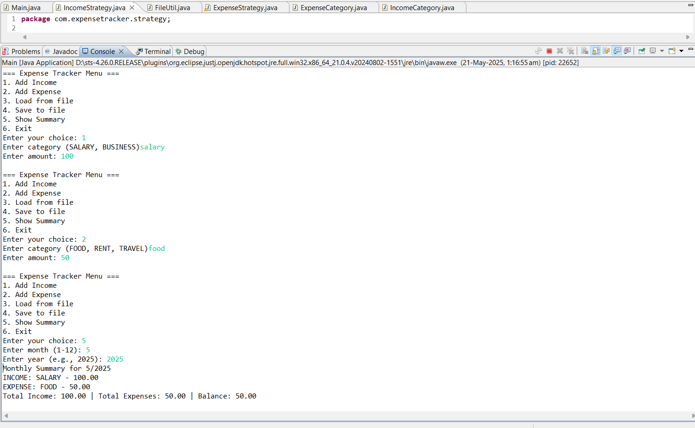
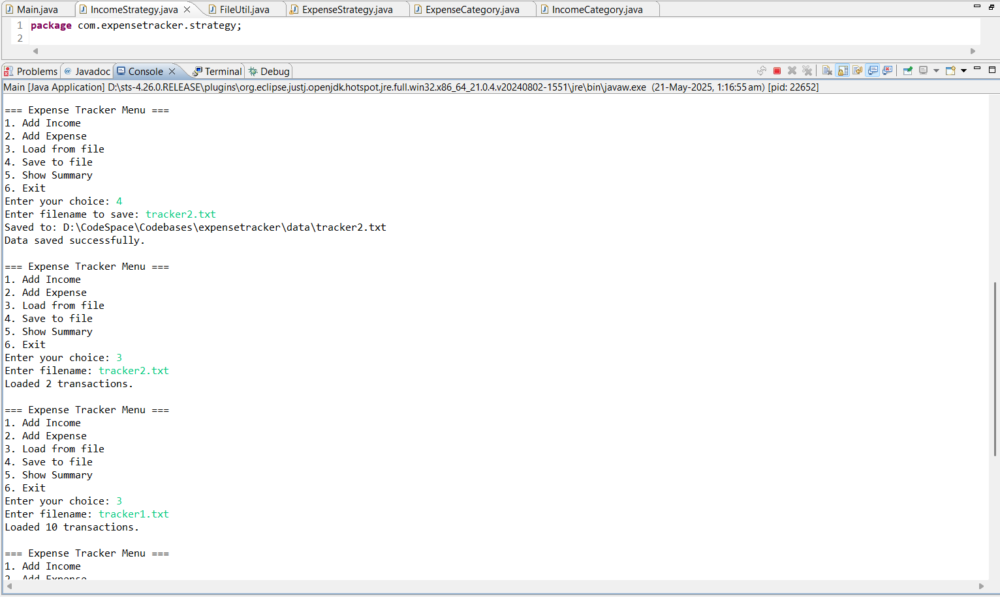
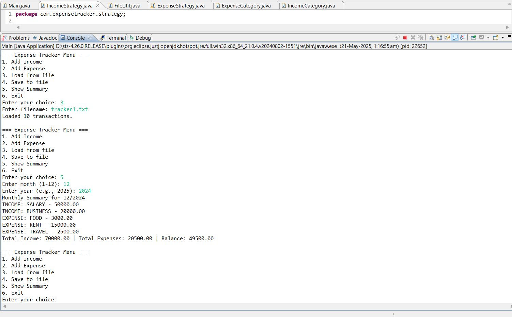
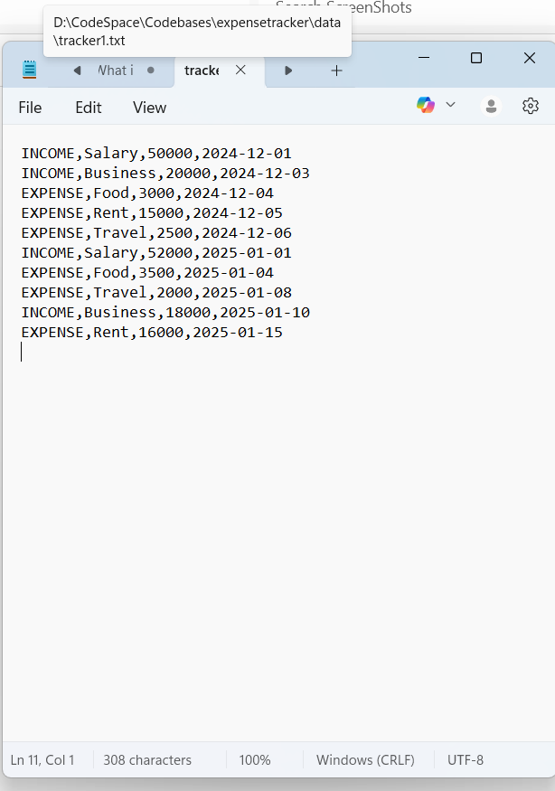

# Expense Tracker (Java Console Application)

A console-based Expense Tracker application built using Java following SOLID principles and Strategy Design Pattern. This project allows users to:

- Add income and expenses  
- Categorize transactions (e.g., Food, Rent, Travel, Salary, Business)  
- View monthly summaries  
- Save/load transactions from a file  
- Handle invalid inputs gracefully

---

## Features

- **Transaction Categories via Enums**  
  Easily categorize incomes and expenses using enums like `IncomeCategory` and `ExpenseCategory`.

- **SOLID Architecture**  
  Designed with modular services, validation, strategy pattern, and custom exception handling.

- **File Support**  
  Save transactions to and load from a `.txt` file for persistence.

---

## Technologies Used

- Java 17+
- Strategy Design Pattern
- Exception Handling
- Enum-based categorization
- File I/O

---

##  How to Run

### 1. Clone the Repository

```bash
git clone https://github.com/kislayuwu/expense-tracker.git
cd expense-tracker

## Screenshots

### Add Income, Expense, Monthly Summary


### Save Transactions as File in data folder


### Load Transactions from File located in data folder



